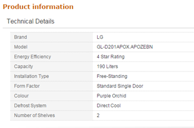
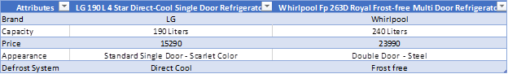
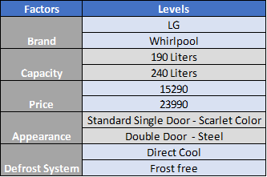

SulekhaAloorravi\_SL\_ASmt
================
Sulekha Aloorravi

Conjoint Analysis:

ConjointAnalysis is a survey-based statistical technique and is used in Market Researchto analyze how a product is valued by consumers depending on the attributes ofthe product.

 

Thisis an article explaining on how to apply conjoint analysis on a product andunderstand the concept through a case study.

Itwill be more beneficial if you practically perform the steps described in thisarticle while reading through the same.

 By the end of this article, you will be able to apply:

1.      A step-by-step approach and perform conjointanalysis for a randomly chosen product 

1. Write R-Code for conjoint analysis

Step-by-Step Approach:

1. Decide a Product to Analyze:

Picking up a suitable data for this case study is rather over whelming due to the abundant number of products available in the market. 

I chose to make use of [Amazon.in](http://www.amazon.in/) to select a product.

Product chosen: Refrigerator

 I just selected two random refrigerator models and copied their Technical details into an excel sheet.



Fig 1: Example Technical details

 2.      Define Attributes or Factors

Technical details of Amazon’s Product Information gave methe data required to decide attributes or factors and their correspondinglevels:



Fig 2: Attributes and their Levels

  3.      Identify Levels for each attribute

From the above table, the factors and their corresponding levels are evident:



Fig 3: 5 Factors and 2 Levels each

Yes, this is a 2^5 Factorial design

4.         Choose the method

The methodology used in this case study is ranking or rating based conjoint analysis. This method helps in identifying the relative importance of an attribute compared to the other, preferences on a product based on Brand, price, color etc. 

 A. Create a full factorial design for a product with 5 attributes and 2 levels each. Level for each attribute can be labelled 1 and 2.

``` r
library(conjoint)
```

    ## 
    ## This is package 'modeest' written by P. PONCET.
    ## For a complete list of functions, use 'library(help = "modeest")' or 'help.start()'.

``` r
Brand <- c("LG", "Whirlpool")
Capacity_Litres <- c("190","240")
Price <- c(15290,23900)
Appearance <- c("SingleDoorScarlet","DoubleDoorSteel")
DefrostSystem <- c("DirectCool", "FrostFree")

FullFactorial<- expand.grid(Brand,Capacity_Litres,Price,Appearance,DefrostSystem)
FullFactorialDesign <- caFactorialDesign(FullFactorial,type="full")
colnames(FullFactorialDesign) <- c("Brand", "Capacity in Liters", "Price", "Appearance", "Defrost System")

FullFactorialDesign$Price <- as.factor(FullFactorialDesign$Price)

View(FullFactorialDesign)

NumberOfProfiles = nrow(FullFactorialDesign)

print(c("Number Of Profiles = ",NumberOfProfiles))
```

    ## [1] "Number Of Profiles = " "32"

``` r
caEncodedDesign(FullFactorialDesign) -> EncodedFullProfile

View(EncodedFullProfile)

cor(EncodedFullProfile)
```

    ##                    Brand Capacity.in.Liters Price Appearance
    ## Brand                  1                  0     0          0
    ## Capacity.in.Liters     0                  1     0          0
    ## Price                  0                  0     1          0
    ## Appearance             0                  0     0          1
    ## Defrost.System         0                  0     0          0
    ##                    Defrost.System
    ## Brand                           0
    ## Capacity.in.Liters              0
    ## Price                           0
    ## Appearance                      0
    ## Defrost.System                  1

``` r
Ravi <- sample(1:32,32)
  
Dileep <- sample(1:32,32)
  
Sasi <- sample(1:32,32)
  
Sailu <- sample(1:32,32)
  
Praba <- sample(1:32,32)
  
Sudha <- sample(1:32,32)  

ConsumerRanks <- rbind(Ravi,Dileep,Sasi,Sailu,Praba,Sudha)

Levels <- c(Brand,Capacity_Litres,Price,Appearance,DefrostSystem)

caModel(Ravi,EncodedFullProfile)
```

    ## 
    ## Call:
    ## lm(formula = frml)
    ## 
    ## Residuals:
    ##      Min       1Q   Median       3Q      Max 
    ## -16.5625  -5.0000  -0.5625   6.3750  19.5625 
    ## 
    ## Coefficients:
    ##                               Estimate Std. Error t value Pr(>|t|)    
    ## (Intercept)                    16.5000     1.5015  10.989 2.87e-11 ***
    ## factor(x$Brand)1               -0.5625     1.5015  -0.375  0.71097    
    ## factor(x$Capacity.in.Liters)1  -0.8750     1.5015  -0.583  0.56507    
    ## factor(x$Price)1               -0.6250     1.5015  -0.416  0.68063    
    ## factor(x$Appearance)1          -2.5625     1.5015  -1.707  0.09980 .  
    ## factor(x$Defrost.System)1       4.3125     1.5015   2.872  0.00801 ** 
    ## ---
    ## Signif. codes:  0 '***' 0.001 '**' 0.01 '*' 0.05 '.' 0.1 ' ' 1
    ## 
    ## Residual standard error: 8.493 on 26 degrees of freedom
    ## Multiple R-squared:  0.3125, Adjusted R-squared:  0.1802 
    ## F-statistic: 2.363 on 5 and 26 DF,  p-value: 0.06786

``` r
caPartUtilities(ConsumerRanks,EncodedFullProfile,Levels)
```

    ##      intercept     LG Whirlpool    190    240  15290  23900
    ## [1,]      16.5 -0.563     0.563 -0.875  0.875 -0.625  0.625
    ## [2,]      16.5  1.187    -1.187  0.000  0.000  0.437 -0.437
    ## [3,]      16.5  1.625    -1.625  1.375 -1.375  0.687 -0.687
    ## [4,]      16.5 -0.813     0.813 -0.500  0.500  0.000  0.000
    ## [5,]      16.5 -0.500     0.500 -0.938  0.938  2.875 -2.875
    ## [6,]      16.5  1.375    -1.375  1.187 -1.187 -1.625  1.625
    ##      SingleDoorScarlet DoubleDoorSteel DirectCool FrostFree
    ## [1,]            -2.563           2.563      4.313    -4.313
    ## [2,]             0.688          -0.688     -1.875     1.875
    ## [3,]             0.062          -0.062     -1.188     1.188
    ## [4,]            -2.563           2.563      3.312    -3.312
    ## [5,]             1.937          -1.937      0.313    -0.313
    ## [6,]             2.000          -2.000      1.000    -1.000

``` r
caSegmentation(ConsumerRanks,EncodedFullProfile)
```

    ## K-means clustering with 3 clusters of sizes 2, 3, 1
    ## 
    ## Cluster means:
    ##       [,1]     [,2]   [,3]   [,4]   [,5]     [,6]   [,7]     [,8]   [,9]
    ## 1 16.06200 17.43700 17.437 18.812 16.687 18.06200 18.062 19.43700 21.187
    ## 2 18.81233 16.02033 17.104 14.312 19.146 16.35433 17.437 14.64567 16.979
    ## 3 20.18700 21.18700 22.062 23.062 14.437 15.43700 16.312 17.31200 16.312
    ##      [,10]    [,11]  [,12]    [,13]    [,14]  [,15]  [,16]    [,17]
    ## 1 22.56200 22.56200 23.937 21.81200 23.18700 23.187 24.562  8.43700
    ## 2 14.18733 15.27067 12.479 17.31267 14.52067 15.604 12.812 20.18767
    ## 3 17.31200 18.18700 19.187 10.56200 11.56200 12.438 13.438 19.56200
    ##      [,18]    [,19]    [,20]    [,21]    [,22]  [,23]  [,24]    [,25]
    ## 1  9.81200  9.81200 11.18700  9.06200 10.43700 10.437 11.812 13.56200
    ## 2 17.39567 18.47933 15.68733 20.52067 17.72933 18.812 16.021 18.35367
    ## 3 20.56200 21.43700 22.43700 13.81200 14.81200 15.687 16.687 15.68700
    ##      [,26]    [,27]    [,28]   [,29]  [,30]    [,31]    [,32]
    ## 1 14.93700 14.93700 16.31200 14.1875 15.562 15.56200 16.93700
    ## 2 15.56233 16.64533 13.85433 18.6880 15.896 16.97933 14.18733
    ## 3 16.68700 17.56200 18.56200  9.9380 10.938 11.81200 12.81200
    ## 
    ## Clustering vector:
    ## [1] 1 2 2 1 3 2
    ## 
    ## Within cluster sum of squares by cluster:
    ## [1]  25.5005 348.6218   0.0000
    ##  (between_SS / total_SS =  84.2 %)
    ## 
    ## Available components:
    ## 
    ## [1] "cluster"      "centers"      "totss"        "withinss"    
    ## [5] "tot.withinss" "betweenss"    "size"         "iter"        
    ## [9] "ifault"

``` r
caImportance(ConsumerRanks,EncodedFullProfile)
```

    ## [1] 17.60 12.57 16.30 23.23 30.31

``` r
caImportance(Ravi,EncodedFullProfile)
```

    ## [1]  6.29  9.79  6.99 28.67 48.25

B.Create an orthogonal design, how many profiles are there?

``` r
OrthogonalProfiles <- caFactorialDesign(EncodedFullProfile,type="orthogonal")

View(OrthogonalProfiles)

cor(OrthogonalProfiles)
```

    ##                    Brand Capacity.in.Liters Price Appearance
    ## Brand                  1                  0     0          0
    ## Capacity.in.Liters     0                  1     0          0
    ## Price                  0                  0     1          0
    ## Appearance             0                  0     0          1
    ## Defrost.System         0                  0     0          0
    ##                    Defrost.System
    ## Brand                           0
    ## Capacity.in.Liters              0
    ## Price                           0
    ## Appearance                      0
    ## Defrost.System                  1

``` r
NumberOfProfiles = nrow(OrthogonalProfiles)

print(c("Number Of Profiles = ",NumberOfProfiles))
```

    ## [1] "Number Of Profiles = " "8"

``` r
Ravi <- sample(1:8,8)
  
Dileep <- sample(1:8,8)
  
Sasi <- sample(1:8,8)
  
Sailu <- sample(1:8,8)
  
Praba <- sample(1:8,8)
  
Sudha <- sample(1:8,8)  

ConsumerRanks <- rbind(Ravi,Dileep,Sasi,Sailu,Praba,Sudha)

Levels <- c(Brand,Capacity_Litres,Price,Appearance,DefrostSystem)

caModel(Ravi,OrthogonalProfiles)
```

    ## 
    ## Call:
    ## lm(formula = frml)
    ## 
    ## Residuals:
    ##          1          2          3          4          5          6 
    ## -5.551e-16  2.991e-16  4.409e-16 -3.486e-16  2.000e+00 -2.000e+00 
    ##          7          8 
    ## -2.000e+00  2.000e+00 
    ## 
    ## Coefficients:
    ##                               Estimate Std. Error t value Pr(>|t|)  
    ## (Intercept)                       4.50       1.00    4.50    0.046 *
    ## factor(x$Brand)1                 -0.25       1.00   -0.25    0.826  
    ## factor(x$Capacity.in.Liters)1     0.25       1.00    0.25    0.826  
    ## factor(x$Price)1                 -1.25       1.00   -1.25    0.338  
    ## factor(x$Appearance)1            -0.75       1.00   -0.75    0.531  
    ## factor(x$Defrost.System)1        -1.00       1.00   -1.00    0.423  
    ## ---
    ## Signif. codes:  0 '***' 0.001 '**' 0.01 '*' 0.05 '.' 0.1 ' ' 1
    ## 
    ## Residual standard error: 2.828 on 2 degrees of freedom
    ## Multiple R-squared:  0.619,  Adjusted R-squared:  -0.3333 
    ## F-statistic:  0.65 on 5 and 2 DF,  p-value: 0.6985

``` r
caPartUtilities(ConsumerRanks,OrthogonalProfiles,Levels)
```

    ##      intercept    LG Whirlpool   190   240 15290 23900 SingleDoorScarlet
    ## [1,]       4.5 -0.25      0.25  0.25 -0.25 -1.25  1.25             -0.75
    ## [2,]       4.5  0.25     -0.25  1.00 -1.00 -0.25  0.25             -1.00
    ## [3,]       4.5  0.50     -0.50  0.50 -0.50 -1.50  1.50              0.50
    ## [4,]       4.5  0.75     -0.75  0.00  0.00  0.00  0.00             -1.25
    ## [5,]       4.5  0.00      0.00 -2.00  2.00 -0.50  0.50              0.50
    ## [6,]       4.5  0.25     -0.25  0.00  0.00 -0.75  0.75              0.00
    ##      DoubleDoorSteel DirectCool FrostFree
    ## [1,]            0.75      -1.00      1.00
    ## [2,]            1.00       1.75     -1.75
    ## [3,]           -0.50       0.50     -0.50
    ## [4,]            1.25      -0.25      0.25
    ## [5,]           -0.50      -0.50      0.50
    ## [6,]            0.00      -1.25      1.25

``` r
caSegmentation(ConsumerRanks,OrthogonalProfiles)
```

    ## K-means clustering with 3 clusters of sizes 3, 2, 1
    ## 
    ## Cluster means:
    ##       [,1]  [,2]     [,3]     [,4]     [,5]  [,6]     [,7]  [,8]
    ## 1 2.166667 2.500 4.833333 5.166667 5.666667 5.000 5.666667 5.000
    ## 2 4.875000 4.125 7.125000 6.375000 5.125000 2.875 3.875000 1.625
    ## 3 2.000000 6.000 2.000000 6.000000 4.000000 8.000 2.000000 6.000
    ## 
    ## Clustering vector:
    ## [1] 1 2 2 1 3 1
    ## 
    ## Within cluster sum of squares by cluster:
    ## [1] 21.33333 22.75000  0.00000
    ##  (between_SS / total_SS =  66.9 %)
    ## 
    ## Available components:
    ## 
    ## [1] "cluster"      "centers"      "totss"        "withinss"    
    ## [5] "tot.withinss" "betweenss"    "size"         "iter"        
    ## [9] "ifault"

``` r
caImportance(ConsumerRanks,OrthogonalProfiles)
```

    ## [1] 11.96 17.02 22.01 21.51 27.50

``` r
caImportance(Ravi,OrthogonalProfiles)
```

    ## [1]  7.14  7.14 35.71 21.43 28.57

C. consumers' willingness to pay for color given the following output of a conjoint analysis. Price has three levels and color has two levels.  Price levels are 50, 100, and 150.  Color levels are Black and White. The coefficients estimated by caModel function are given below. Price 50    7.8 (\*Price levels should be 50 and 100) Price 100    0.8 Colour Black   1.4

Explanation;

In conjoin analysis, sum total of all co-efficients for an attribute should be equal to 0.

In this case, there are 3 levels for Price - 50, 100, 150. Co-efficients for: Price 50 = 7.8 Price 100 = 0.8

``` r
PriceData = c(50,100,150)
Price50 = 7.8
Price100 = 0.8
#Calculating Coefficient of Price 150
Price150 = 0 - (Price100+Price50)
Price150
```

    ## [1] -8.6

``` r
#Calculating Range of Price
Range.CoeffPrice = Price50-Price150
Range.CoeffPrice
```

    ## [1] 16.4

``` r
Range.Price = max(PriceData) - min(PriceData)

UnitSatisfaction = Range.Price/Range.CoeffPrice
UnitSatisfaction
```

    ## [1] 6.097561

``` r
#Calculating Willingness to pay for color
ColorBlack = 1.4

#Color white as per conjoint analysis sum total of coefficients will be
ColorWhite = 0-ColorBlack
ColorWhite
```

    ## [1] -1.4

``` r
#Range of coefficient of color:
Range.CoeffColor = ColorBlack - ColorWhite

#Willingess to Pay for Color
WIP.Color = UnitSatisfaction * Range.CoeffColor
```
